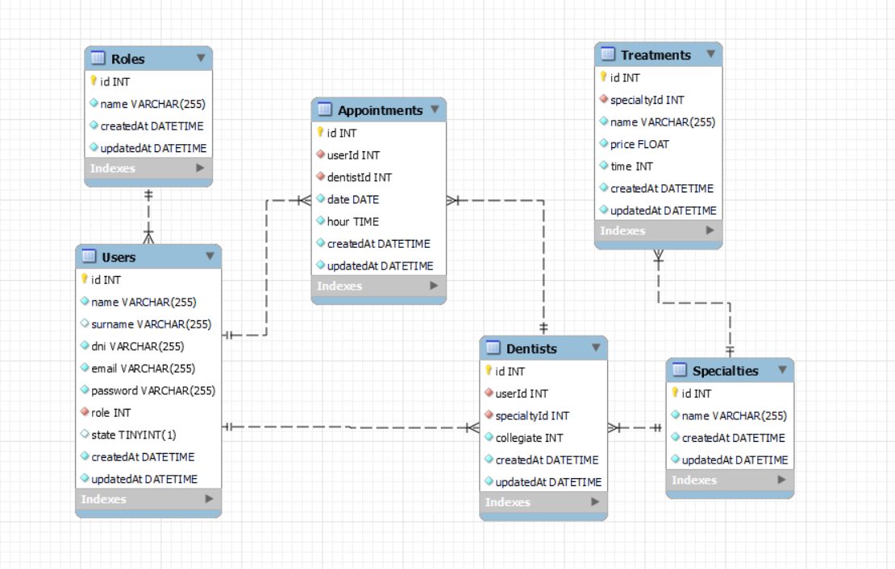

__<p align="center">Proyecto 3 - Mastermind - Semana 4</p>__
<h2 align="center">⚙️ Primer proyecto de backend ⚙️</h2>

<details>
  <summary><b>Contenido</b> 📝</summary>
  <ol>
    <li><a href="#sobre-el-proyecto">Sobre el proyecto</a></li>
    <li><a href="#stack">Stack</a></li>
    <li><a href="#diagrama-bd">Diagrama</a></li>
    <li><a href="#instalación-en-local">Instalación</a></li>
    <li><a href="#endpoints">Endpoints</a></li>
    <li><a href="#licencia">Licencia</a></li>
    <li><a href="#webgrafia">Webgrafia</a></li>
    <li><a href="#agradecimientos">Agradecimientos</a></li>
    <li><a href="#contacto">Contacto</a></li>
  </ol>
</details>


### Sobre el proyecto

Durante esta primera toma de contacto con el backend, hemos trabajado en el desarrollo de una API funcional para una clínica dental. 

Esta API se conecta a una base de datos MySQL diseñada específicamente para satisfacer las necesidades de la clínica.

He logrado implementar todas las funcionalidades especificadas, proporcionando a la clínica dental una herramienta eficiente para gestionar su flujo de trabajo. Estoy satisfecha del trabajo realizado y del conocimiento adquirido.  

### Stack
<div align="center">

<a href="https://www.expressjs.com/">
    
</a>
<a href="https://nodejs.org/es/">
    
</a>
 
 
 

</div>

### Diagrama BD


### Instalación en local
1. Clonar el repositorio
2. `$ npm install`
3.  Instalamos dependencias: 
`$ express nodemon sequelize sequelize-cli mysql2 bcrypt jsonwebtoken dotenv`
4. Conectamos nuestro repositorio con la base de datos 
5. Ejecutamos las migraciones `$ npx sequelize-cli db:migrate` 
6. Ejecutamos los seeders `$ npx sequelize-cli db:seed:all`
7. `$ npm run dev`

### Endpoints
<details>
<summary>Endpoints</summary>

[](https://app.getpostman.com/run-collection/27697255-c61a3dad-5040-4553-a36a-d11ead64ac45?action=collection%2Ffork&source=rip_markdown&collection-url=entityId%3D27697255-c61a3dad-5040-4553-a36a-d11ead64ac45%26entityType%3Dcollection%26workspaceId%3Db6c89ddc-e5ae-481f-8c5a-ae982819ae1e)
            
</details>


### Licencia
📝 La licencia utilizada es una MIT License. Este proyecto ha sido realizado por mí, Judit Grau Puigdollers, inéditamente para la tarea 'Backend Clínica Dental' en la edición de abril 2023 de GeeksHubs Academy.

``` js
 const developer = "ditGrau";
 console.log("Desarrollado por: " + developer);
```  
### Webgrafia
- Errores HTTP: https://http.cat/
- Consultas de js: https://es.javascript.info/
- La documentacion oficial de las dependencias
- El material proporcionado por Geekshubs Academy

### Agradecimientos:

Agradezco a mis compañeros y docentes, pero en especial a Coral, compi hasta en las duras y a Dani, un docente sin igual:
Más de 100 commits, muchas horas y mucho REFACTOR, pero ha valido la pena.

- **CORAL**  
<a href="https://github.com/Coral-JM" target="_blank"></a> 
- **DANI**  
<a href="https://github.com/datata" target="_blank"></a> 


<h3 align="center">Contacto</h3>

<div align="center">
 📩 <a href = "mailto:juditgraup@gmail.com"></a>👋🏼<a href="https://www.linkedin.com/in/linkedinUser/" target="_blank"></a> 
</p>
</div>
